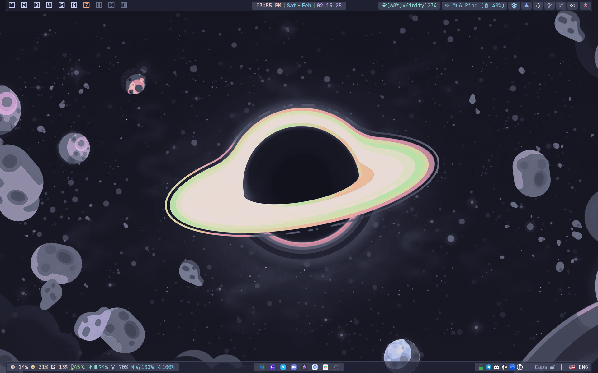

# ❄️ My NixOS Config | Thinkpad Edition 🐧

<center></center>

## 💻 Thinkpad T14 Gen 4 | Hardware Stats

- 🏷️ **Model**: `21HD0072US`
- 🚀 **Memory**: **36GB DDR5**
- 🔥 **Processor**: *12 x 13th Gen Intel(R) Core(TM) i7-1365U*
- 🎮 **Graphics**: Intel Corporation Raptor Lake-P [*Iris Xe Graphics*] (rev 04)
- 💽 **Storage**: 1x SSD - **2TB** - NVME

- 🎯 **OS**: *NixOS 24.11*
- 🖥️ **DE**: *Hyprland*
- ✨ **Windowing System**: *Wayland*

---

## 💾 NixOS Disk Layout | Storage Architecture

- 💽 **Disk**: `/dev/nvme0n1`
- 📋 **Partition table**: *GPT*
- 🔐 **Root filesystem**: **BTRFS** (*LUKS encrypted*)

### 📦 Partitions

- 🔄 **Boot (ESP)**
  - *Size*: **2GB**
  - *Type*: `FAT32`
  - *Mount*: `/boot`

- 💫 **Swap**
  - *Size*: **40GB**

- 🛡️ **Root** (*encrypted*)
  - *Size*: **Remaining space**
  - *Encryption*: **LUKS** (*Argon2id*)
  - *TRIM*: `enabled`

- 📁 **BTRFS Subvolumes**
  - *Compression*: `zstd:2`
  - ⚡ *SSD optimized*
  - 🔄 *Async discard*

```shell
@ -> /
@nix -> /nix
@var -> /var
@varlog -> /var/log
@home -> /home
@snapshots -> /.snapshots
@cache -> /var/cache
```
---

## 🚀 Installation | Quick Start Guide

✏️ 1. To change the default username and/or hostname, Find `jondaw` and `arasaka` and fix all instances of the username/hostname

📂 2. Copy or move all files (with replacements) from the `home` directory to your `$HOME` directory in Linux

🔧 3. Copy or move all files (with replacements and **sudo** permissions) from the `nixos` directory to `/etc/nixos/`

If not, change ownership using the command:

```bash
sudo chown -R root:root /etc/nixos
```

🔄 4. Run the command:

```bash
sudo nixos-rebuild switch --flake /etc/nixos#arasaka --update-input nixpkgs --update-input rust-overlay --commit-lock-file --upgrade
```

🎨 5. **Post-installation configuration**:

 - Import GNOME settings along with the theme by executing:
```bash
dconf load / < ~/.config/gnome_settings_backup.dconf
```

🍴 *Fork of: https://github.com/XNM1/linux-nixos-hyprland-config-dotfiles*
